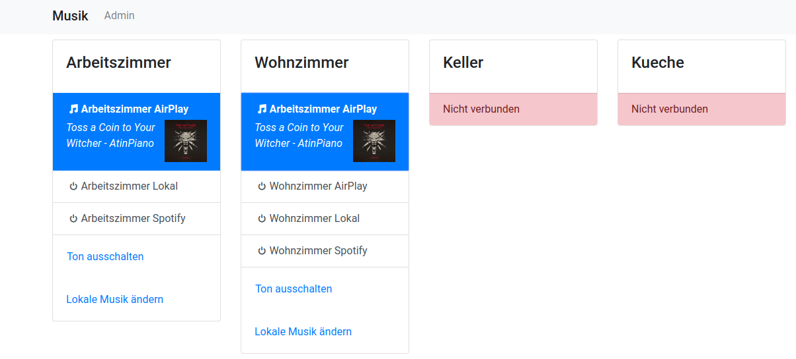

# Snapcast Control Web Interface



A web interface for [Snapcast](https://github.com/badaix/snapcast).
It allows you select which stream is played on which client.
It also has support to select local radio and files from Mopidy instances.
Currently, the UI is in German. If you are interested in using an English version, please open an issue.

## Installation

```bash
# Install Go (if not already installed)
# Download from https://golang.org/dl/ or use your package manager

# Build the frontend
cd frontend-react
yarn install && yarn build
cd ..

# Build the Go server
go build -o snapcast-control

# Run the server
./snapcast-control --port 8080
```

Add an entry to crontab to start snapcast-control after booting:

```bash
sudo crontab -e # sudo is only needed for ports < 1000
```

```crontab
@reboot sleep 10 && /absolute/path/to/snapcast-control/snapcast-control --port 80
```

## Development

Server:

```bash
# Build and run
go build -o snapcast-control && ./snapcast-control --debug --port 8080

# Or run directly
go run . --debug --port 8080
```

Client:

```
cd frontend-react
yarn install && yarn start
```

## SnapCast Update

```
cd ansible
ansible-playbook playbook.yml
```